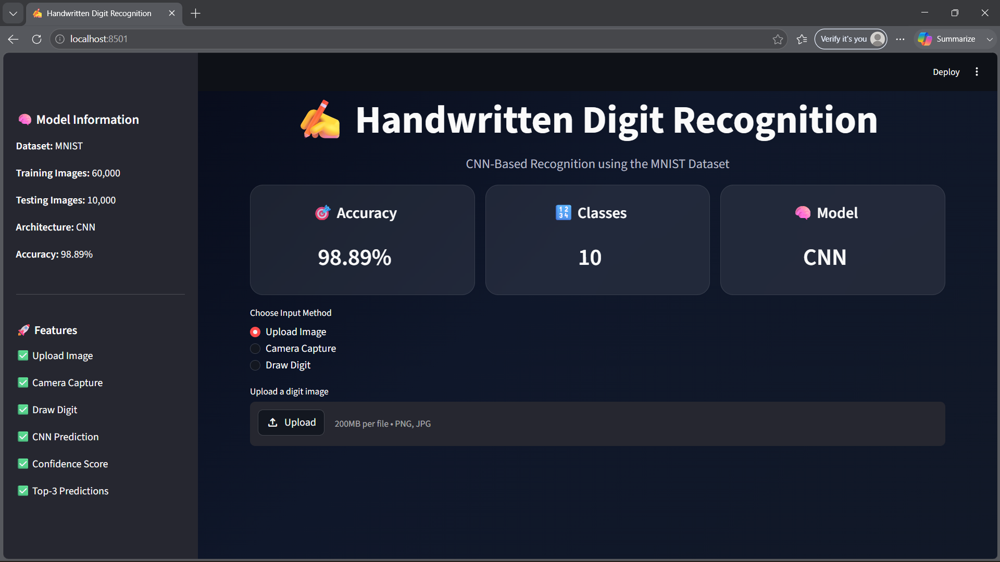
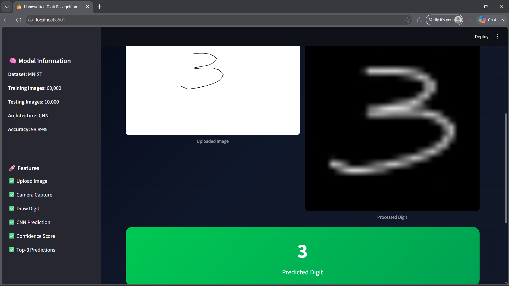
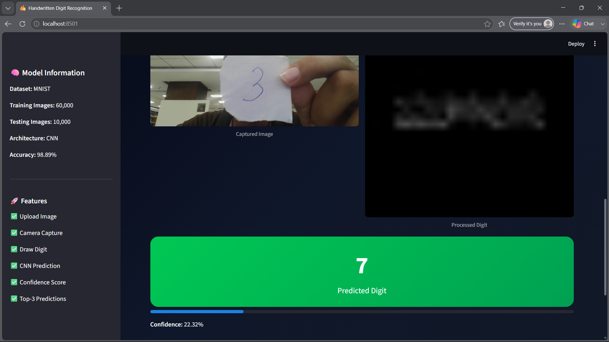
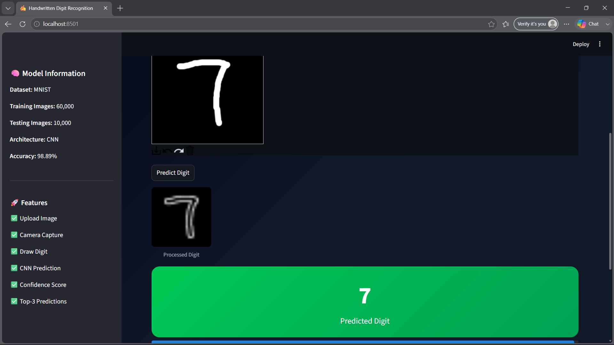

# ✍️ Handwritten Digit Recognition using CNN

## Overview

This project implements a **Handwritten Digit Recognition System** using a **Convolutional Neural Network (CNN)** trained on the **MNIST dataset**. The application can recognize handwritten digits (0–9) through multiple input methods, including image upload, camera capture, and freehand drawing.

A modern **Streamlit-based web application** is provided for real-time digit prediction with confidence scores and top-3 prediction probabilities.

---

## Features

- Upload handwritten digit images
- Capture handwritten digits using a webcam
- Draw digits directly on a digital canvas
- Real-time CNN prediction
- Confidence score display
- Top-3 prediction probabilities
- Image preprocessing pipeline
- Modern Streamlit user interface
- Responsive and interactive design

---

## Model Performance

| Metric | Value |
|----------|----------|
| Dataset | MNIST |
| Model | Convolutional Neural Network (CNN) |
| Test Accuracy | 98.89% |
| Classes | 10 (Digits 0–9) |

---

## Project Structure

```text
Task1/
│
├── Deployment/
│   ├── app.py
│   └── requirements.txt
│
├── Model/
│   └── digit_model.h5
│
├── Notebook/
│   └── digit_recognition.ipynb
│
├── Results/
│   ├── app_ui.png
│   ├── upload_image.png
│   ├── draw_digit.png
│   ├── camera_capture.png
│   ├── ClassDistribution.png
│   ├── ModelAccuracy.png
│   ├── ModelLoss.png
│   ├── ConfusionMatrix.png
│   ├── WrongPredictions.png
│   └── recognition.png
│
└── README.md
```

---

## Workflow

1. Load and preprocess the MNIST dataset
2. Perform Exploratory Data Analysis (EDA)
3. Build and train a CNN model
4. Evaluate model performance
5. Save the trained model
6. Deploy using Streamlit
7. Predict handwritten digits from user inputs

---

## Input Methods

### 📤 Upload Image

Upload an image containing a handwritten digit and receive a prediction with confidence score.

### 📷 Camera Capture

Capture a handwritten digit using your webcam and obtain instant predictions.

### ✏️ Draw Digit

Draw a digit directly on the interactive canvas and receive real-time predictions.

---

## Results

### Model Evaluation

- Class Distribution Analysis
- Training Accuracy Curve
- Training Loss Curve
- Confusion Matrix
- Wrong Prediction Analysis
- Sample Predictions

### Application Screenshots

#### Main Application UI



#### Upload Image Prediction



#### Camera Capture Prediction



#### Draw Digit Prediction



---

## Installation

Clone the repository:

```bash
git clone https://github.com/Bharath-691/Cloudcredits/tree/main/Task1
cd Task1
```

Install dependencies:

```bash
pip install -r requirements.txt
```

Run the Streamlit application:

```bash
streamlit run app.py
```

---

## Requirements

- Python 3.10+
- TensorFlow
- Streamlit
- OpenCV
- NumPy
- Pillow
- Matplotlib
- streamlit-drawable-canvas

---

## Technologies Used

- Python
- TensorFlow / Keras
- OpenCV
- NumPy
- Streamlit
- Pillow
- Matplotlib

---

## Author

**Bharathchandran BR**