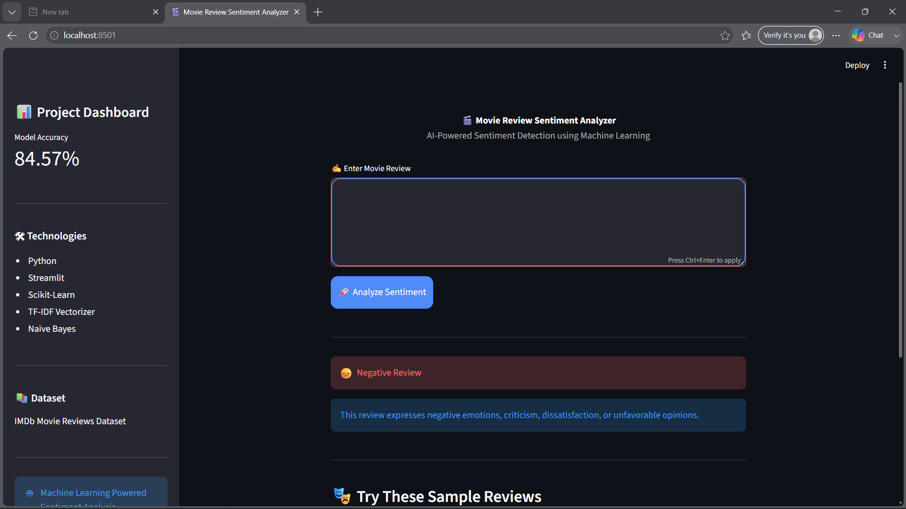
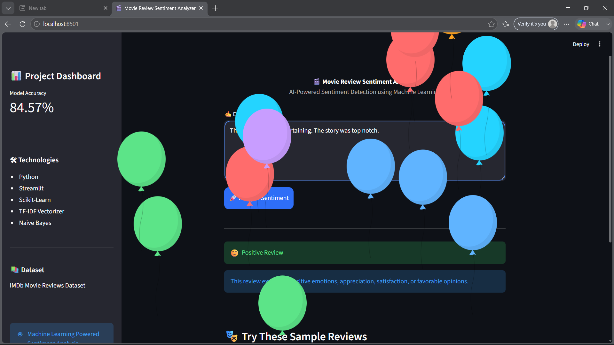
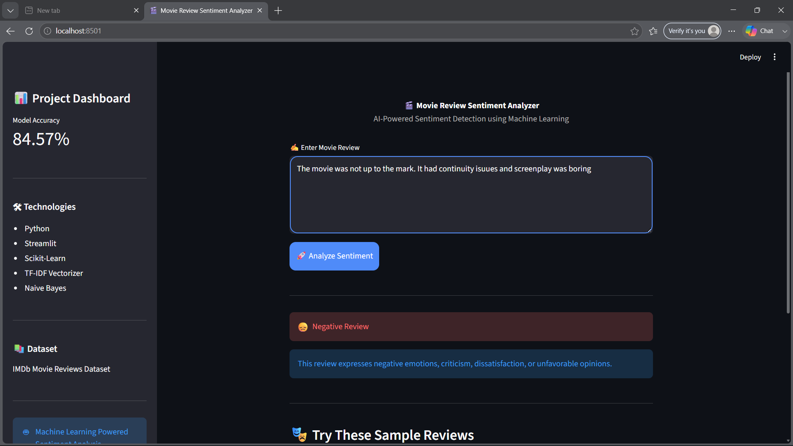
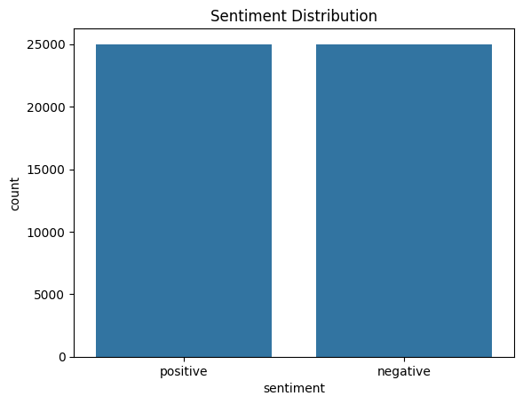
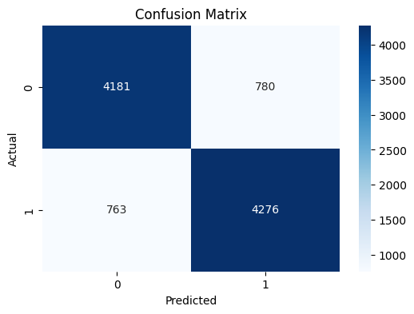

# 🎬 Movie Review Sentiment Analyzer

## Overview

This project performs sentiment analysis on movie reviews using Machine Learning. It classifies a review as **Positive** or **Negative** through an interactive Streamlit web application.

## Dataset

- IMDb Movie Reviews Dataset
- 50,000 movie reviews
- Balanced positive and negative samples
Source: https://www.kaggle.com/datasets/lakshmi25npathi/imdb-dataset-of-50k-movie-reviews

## Technologies Used

- Python
- Pandas
- Scikit-Learn
- Streamlit
- Matplotlib
- Seaborn

## Model

- TF-IDF Vectorization
- Multinomial Naive Bayes Classifier

## Results

- **Accuracy:** 84.57%
- Evaluated using Accuracy, Precision, Recall, and F1 Score

## Features

- Real-time sentiment prediction
- Interactive Streamlit interface
- Positive/Negative review classification
- Machine Learning powered text analysis

## Screenshots

### Streamlit Application



### Positive Review Prediction



### Negative Review Prediction



### Sentiment Distribution



### Confusion Matrix



## Project Structure

```text
Task2/
├── app.py
├── data/
├── model/
├── notebook/
├── screenshots/
├── requirements.txt
└── README.md
```

## How to Run

```bash
pip install -r requirements.txt
streamlit run app.py
```

## Sample Prediction

### Input

```text
This movie was absolutely fantastic and amazing.
```

### Output

```text
😊 Positive Review
```

## Author

**Bharath Chandran BR**

Machine Learning & Artificial Intelligence Internship Project